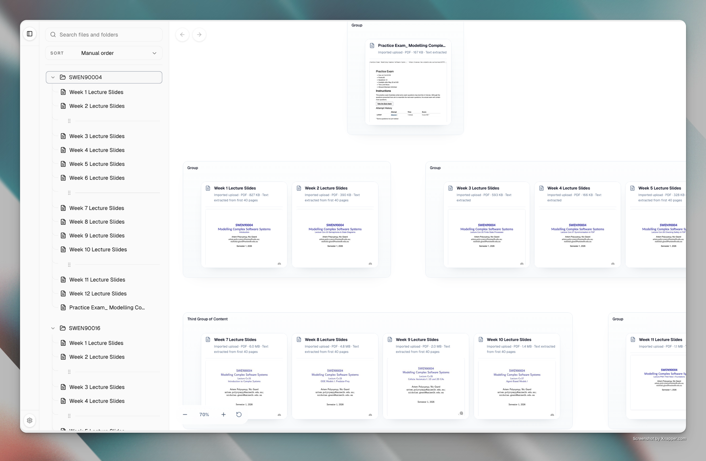
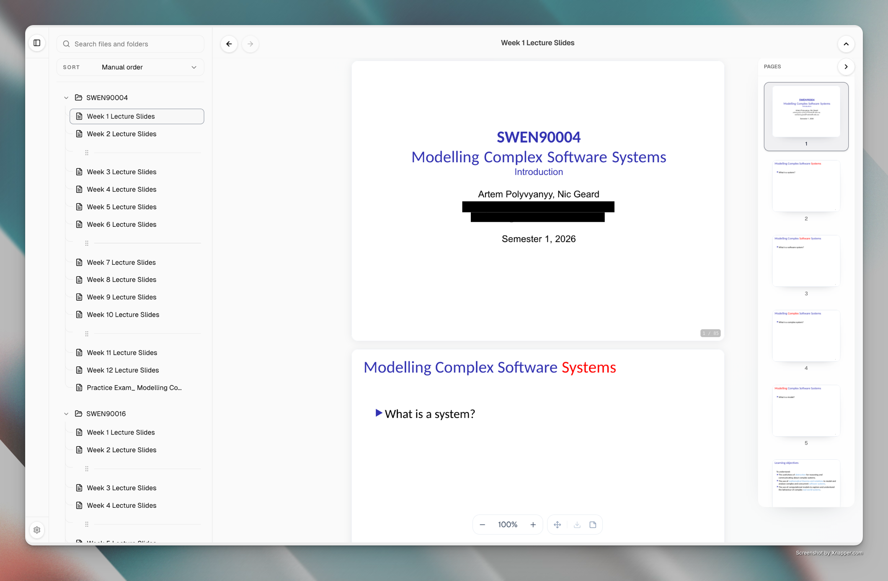

# Weave

A clean, visual workspace for organizing files, documents, and ideas.

Weave combines a familiar file explorer with a freeform canvas. Arrange files and
folders visually, group and connect items, or open a document view to read and edit
content. The workspace runs locally in the browser and supports uploads, previews,
and downloads.





## Run locally

```bash
npm install
npm run dev
```
